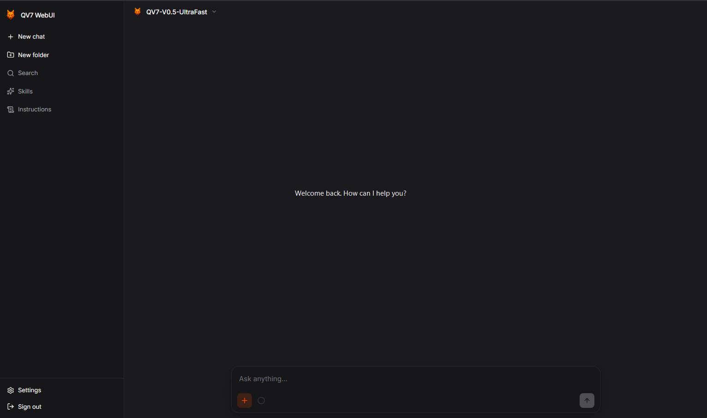

# QV7 WebUI

**Disclaimer.** The interface was designed by a human. The code was written by AI. This project is provided as is, with no support. I just wanted to share what I personally use :)



QV7 WebUI is an open-source chat interface for models you run yourself. The browser talks only to this app. This app talks to Ollama and to any OpenAI-compatible connection an admin adds.

## Features

- Chat with models from Ollama or any OpenAI-compatible connection
- Model picker, with only the models an admin has enabled
- Thinking, when the model supports it
- Web search, code interpreter, and image create or edit
- File, image, and webpage attachments
- Skills, folder instructions, and personal tone
- Memory the model can save and search
- Canvas pages beside the chat
- Accounts, roles, and optional public sign-up
- Branding, dark and light themes, and English or Dutch
- Installable in the browser, including on a phone

The project site and documentation are at [qv7.nl](https://qv7.nl).

- [Documentation](https://qv7.nl/docs)
- [Install](https://qv7.nl/docs/requirements)
- [Docker Compose](https://qv7.nl/docs/docker)
- [Privacy](https://qv7.nl/privacy)

Licensed under the [MIT License](LICENSE).

- [Code of conduct](CODE_OF_CONDUCT.md)
- [Contributing](CONTRIBUTING.md)
- [Security](SECURITY.md)

## What you need

- [Ollama](https://ollama.com), reachable from the machine that runs QV7 WebUI
- Node.js 22 or newer, **or** Docker Engine with Docker Compose

## Run with npm

```bash
cp .env.example .env
```

Set `OLLAMA_BASE_URL`, `SESSION_SECRET`, `INITIAL_ADMIN_EMAIL`, and `INITIAL_ADMIN_PASSWORD`. For local development, set `PORT=8787` so the API matches the dev server proxy.

```bash
npm install
npm run dev
```

Open http://localhost:5173 and sign in with the admin account from `.env`. Then go to Admin → Models, refresh, and enable the models you want.

For a server that stays up, use Node.js 22, `npm run build`, and a process manager. The public steps are in the [install guide](https://qv7.nl/docs/setup).

## Run with Docker Compose

In `.env`, point Ollama at the Docker host and set the address you will open in the browser:

```env
OLLAMA_BASE_URL=http://host.docker.internal:11434
WEB_ORIGIN=http://localhost:3000
PORT=3000
NODE_ENV=production
```

```bash
docker compose up -d --build
```

The database stays in `./data` and uploads stay in `./uploads`. More detail is in the [Docker guide](https://qv7.nl/docs/docker).

## Reverse proxy

Chat replies are a long stream. Turn buffering off for `/api/chat`, or the reply waits until the model finishes.

```nginx
proxy_buffering off;
proxy_cache off;
proxy_read_timeout 3600;
```

Keep Ollama on your own network. Do not expose it to the browser.
